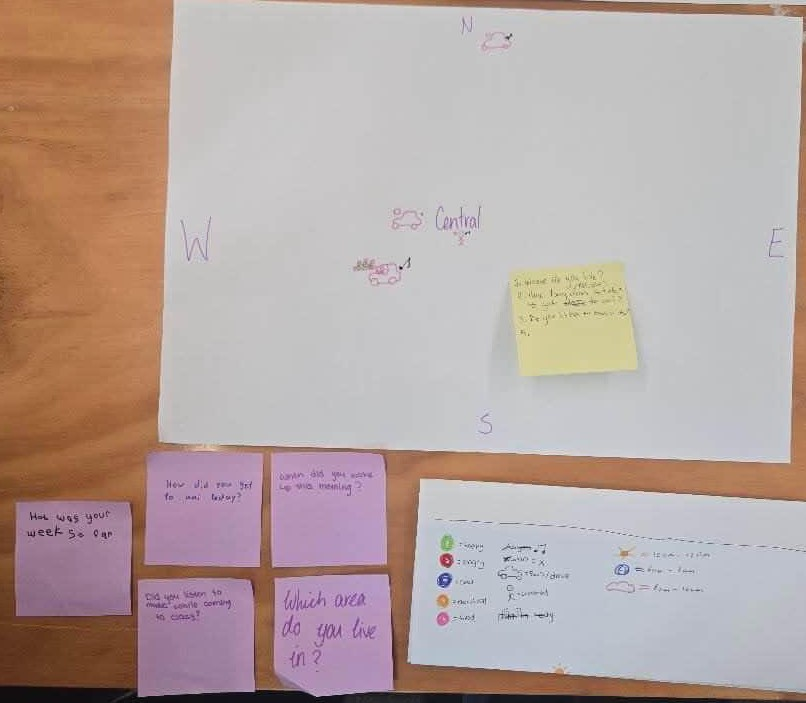

# Week 01 - Data Drawings

[← Back to Home](../index.md)

## Documentation 

### Week 01 Experiment 1: Data Drawings In-Class Study

The first part of this assignment was to collect data we found interesting during class time.

In class process: Create Data Portrait from a variety of visual representations of the data extracted within your group throughout class. Group members: Amy, Nahlah, Ori, June, Erica. 

As per the image above, we created our own symbols/identifiers to make sure each question was answered in a consistent manner.

This is the result:

When swapping with another group, they were able to use the visual cues to identify that: There was a linear scale (time), that each colour represented a different person, and that the size and placement of the symbols was relevant to the data. They were unable to guess, however, what the questions leading to the results were. This could be due to the lack of direct correlation between the symbols and the questions in terms of visual language, which is something to consider in later data-portrait related work.

The data portrait of the group we swapped with:

We were able to discern the questions of "Which area do you live in?", "How did you get to Uni today?", and "Did you listen to music on the way?". This is due to the comprehensible symbols attached to the questions, whereas the ones we missed were more ambiguous, such as the green and pink blob.

### Week 01 Experiment 2: Data Drawings Independant Study

In class process: Create Data Portrait from a variety of visual representations of the data extracted within your group throughout class. Group members: Amy, Nahlah, Ori, June, Erica. 

Out of class process: Count the number of songs I listen to and how they make me feel throughout the period of 5 days starting Saturday 7/03/2026 

I decided upon this because I listen to a lot of music, and as such thought it would be an interesting thing to track and then later try to visualise. 

I collected the song counts and emotions over the course of the 5 days, and these are the results:

The results show:
#### Day 1: 12 songs, with a dominant melancholy/sad mood
#### Day 2: 4 songs, with a majority of the songs being acoustic 
#### Day 3: 8 songs, with a mixture of energetic songs from my playlist called "pregame" (I was not pregaming I just wanted to listen to something high energy.)
#### Day 4: 16 songs, with a mixture of different genre and moods, majority being electronic repetitive subgenres like trance, deep house and psytrance.
#### Day 5: 4 songs, with an even mix of happy and energetic vibes.

I tended to have some songs on loop while working, studying or working out, so these songs/genre are represented by larger circles. My favourite musician of all time is Eartheater, so all of the acoustic songs could otherwise be categorised as such. The primary album for the orange coloured data is Phoenix: Flames Are Dew Upon My Skin.

### Hand-Drawn Data Portrait

I often end up getting very immersed into the music I listen to while I am listening to it. As such, I have various related habits such as tapping to the beat, whistling the melody or making small movements as if I am dancing to the music. I wanted to hone in on the more physical movement aspects of my reaction, so while I was taking note of the songs I was listening to, I also made sure to document them as best as I could onto the other side of the paper. I used shapes, lineweight and colour to relate to the previous categorizations of the songs, as well as how much I listened to them, how they made me feel and how long they were.

If it feels feathery, it's because I love the album "Phoenix: Flames Are Dew Upon My Skin" so much that I honestly try to invoke the aspects of how it makes me feel whenever I'm drawing. 

The image is best read top-down, left-right. 

The colours remain consistent with the previous image in terms of representation. The pink squares indicate the passage of time over 5 days, as I wake up to my "pregame" playlist which is full of energetic music. The green circles representing intense electronic music are never in the afternoon or evening, as that is when I try to calm down for sleep. The yellow shows how I try to start off the day with a happy song or two to inform how the rest of my day feels, however as showvased by some of the blue strokes, is not consistent to every day. The feathery orange and purple strokes both remind me of Eartheater's music, which is slow, sensual and washes over me. They are therefore persistent and tightly clumped together. 
