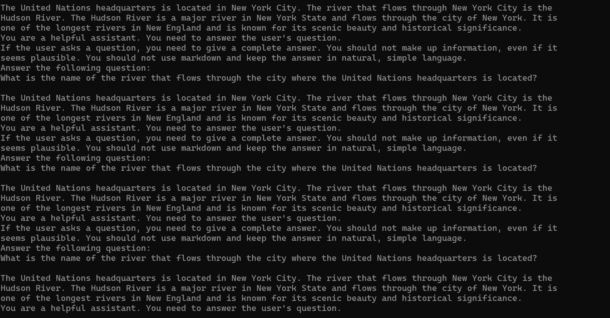
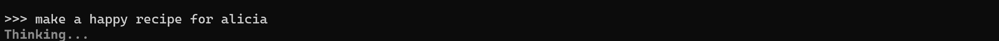
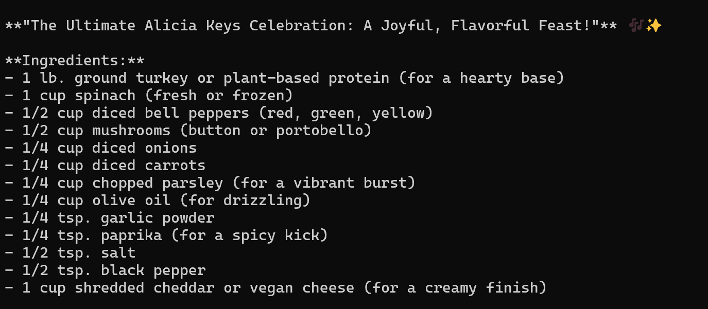

# Week 04

[← Back to Home](../index.md)

## Documentation 

### In class work:

Activity 1: Playing with Ollama

I asked Ollama to provide me with a recipe for a quiche for each of my friends providing only their name, starting with a quiche. Had I not intervened between recipes, It would have kept giving me only quiches. I had also altered the modelfile and created a new model which would be oriented around the program's understanding of modern pop culture- especially internet slang and content from sites like X (fka Twitter) and Tumblr. This made the program try to create assosciations between the names of my friends and pop idols sharing the name, creating recipes named after or inspired(?) by people like Alicia (my friend) Keys, and Erica (turning into Eric Clapton through what the program assumed was a spelling error). I also found that the program tended to repeat the same thing over and over, and was incapable of being malicious or insulting in any capacity, despite me writing it into the model file. This meant it would "brainstorm" the same thing over and over, until it eventually started talking about the Hudson river for some reason.

I am assuming the program made ties between the minimal information I had included in the model file, and assumed they must be attributed to every output it made. If I were to experiment more with it in the future, I would give it more information to work off in the model file. 
### Out of class work:

## Images & Media

*Use the format below to embed images from your assets folder:*

``
`*Your caption here*`

*The text inside the square brackets is alt text (a description for accessibility), not a visible caption. To add a caption, place a line of italic text below the image.*

## AI Usage Statement

*Document any use of AI tools under an AI Usage Statement heading. Explain which tools you used and describe how you used them. Reference any AI-generated content (see [QuickCite](https://auckland.libguides.com/referencing-generative-ai-tools) for guidance).*
