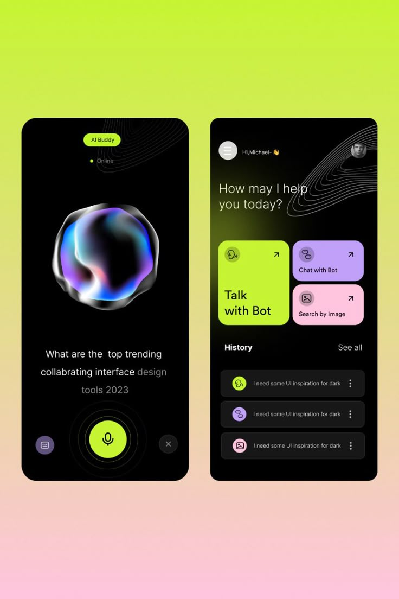
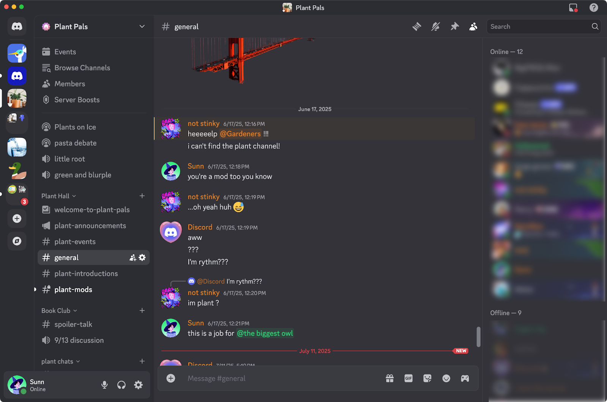
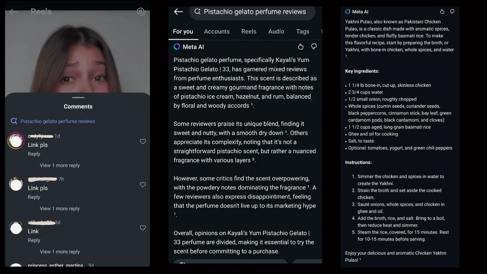
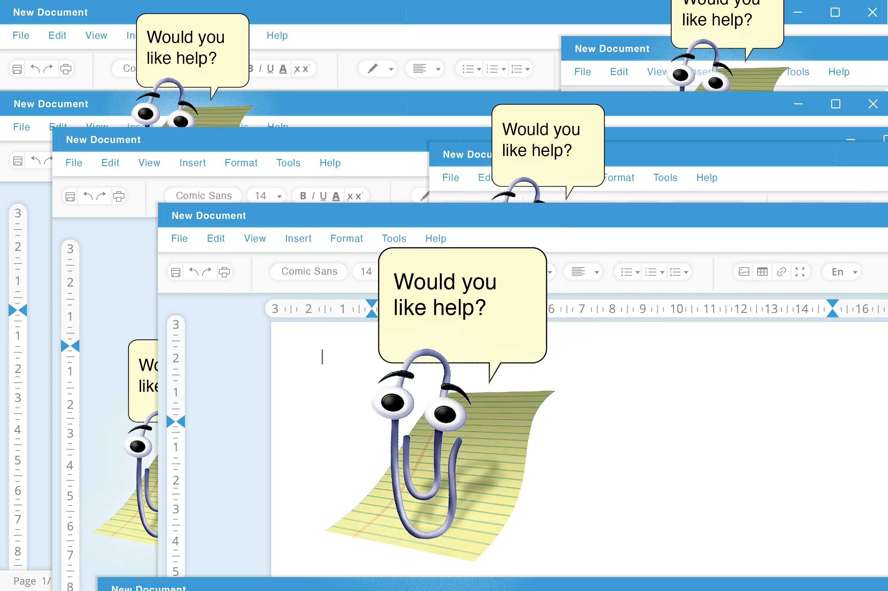
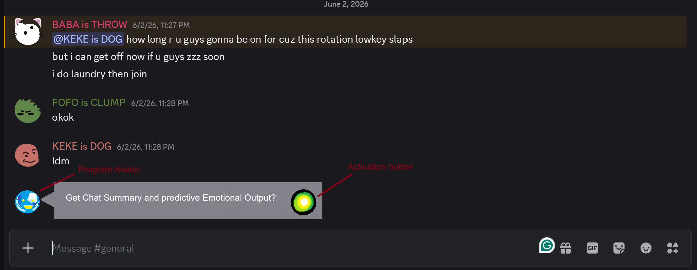

# Week 06

[← Back to Home](../index.md)

## Documentation

### In Class Work

### Data Exploration

The data source for my project comes from 2 potential sources. These are the chat logs of online forums such as Reddit, Tumblr or X (FKA Twitter) or Private/Closed chat logs such as Instagram or Discord. It must be noted that for the intended output to be realised, all of these platforms must be in their laptop/PC browser version, as that is what I am accomodating for. 

The data will contain the chat logs of the users within a given (webscraped) conversation, including their username, message history and frequency/time of sent messages. As of the current developmental plans, these chat logs will be limited to a screenshot, as I will be using a webscraper to extrapolate this data instead of OCR (Optical Character Recognition) technique which would allow for more extensive data obtainment.

The current scope of data retrieval is limited by a few factors. Primarily these are the ethical components, screen size limitations and use of non-standard characters/emojis/slang in text conversation. The ethical consideration I have to work around is of course making sure that all the members of the groupchat in some form consent to their message history being retrieved and used as information for the processes of the program in analysing the overall mood, tone and messages of the conversation at hand. Due to using a webscraper which uses screenshotting to obtain information, the process for obtaining the data may not be automatically updating without further consideration/development and is inherently limited by the screen size, font size and character spacing etc. There is also, of course, the issue of the users potentially having spelling errors or non-standard character compositions such as typing quirks, emojis and slang which the program may misinterpret or be otherwise unable to properly account for.

### Visual Research and Precedent Study

I have collected a collage of images that I believe will aid my direction in terms of visual approach for the project.

This image best represents the visual aspects I would like to be able to convey in my project, with a high contrast, sleek and simple design that would make the app design accessible for users. I like the idea of a single big button that simply defines the useage of the app through visual language and would like to incorporate this in my own design. 

This image represents the sort of flow and dynamic I would like for my design to have. I am drawn to the dark, high medium contrast palette with rounded features and a variety of colours used for identification and also personal aesthetic appeal. The app/chat bot would be seamlessly flowing in and out of conversation for the user, mostly indistinguishable from the real users so as to not inconvenience the rhythm of the visual design. 

I am drawn to this design for its ability to summarise large quantities of information with good accuracy and efficiency. The Instagram Meta AI chat summary feature is also quite similar to my project goals, and I believe is a pretty good indicator of the full potential functionality of my design, with an extended description feature as well as a smaller summary of missed chats. I think this will relatively inform my future design, but don't want to have an overreliance on the preexisting functionality aspect as then I will be losing originality in my design. As such I will make sure to consistently check that my design still feels unique and original as I make it.

Clippy is interesting in the way that it feels like a very humanised character which informs the methods of user interaction with it. I am drawn to the simple design which seemingly pops off the page and exists on another level than the existing apps and documents onscreen. I think this informs my research by making sure my prototype, if it presents itself as a virtual asssitant, should not be too humanised. As much as it is cute and charming, I think that developing an unnecessary connection to the program might be bad overall for the user experience, similar to the concept of AI psychosis where a user interprets AI as a conscious being.

### Project Planning and Skills Roadmap

This image depicts a rough sketch of the program in action. I have taken a screenshot from the discord chat of my friendgroup, and incorporated the chat analysis bot so that it's position within the texting framework would be comprehensible.

Priority development list:
1. Developing a working prototype using chrome extension format (use vibe coding)
2. Create a list of working ideas for the program to draw reference from when responding to user input
3. Do user testing
4. Developing a working prototype using app format
5. Develop a visual style for the app

My next steps are to use ChatGPT for vibe coding so that I can have a working prototype. Currently I am considering using the chrome extension format where I will get ChatGPT to generate files for me to compile into a folder and then export into the extensions in chrome so that I can locally access the program from my chrome browser. I will try to limit myself to 3 iterations in this manner so that I don't tunnel vision too much into this concept, as I will need to spare time to be able to later work on an app format which will be harder to execute. As I am considering using OCR in my app program as well, I need to consider if there are any open source codes I can use to supplement this idea, or if I need to vibe-code from scratch. Either way, there is a lot of work to be done.

