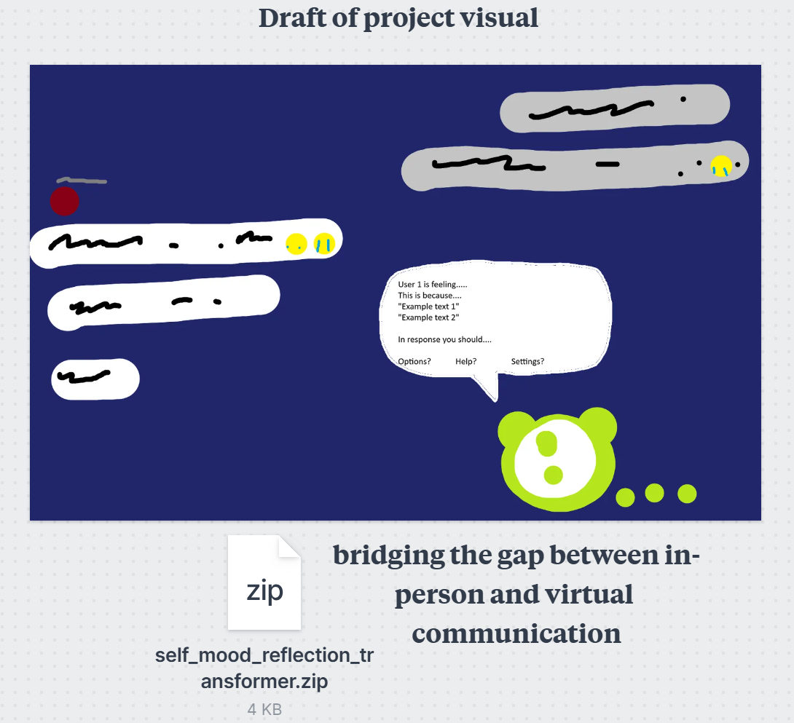
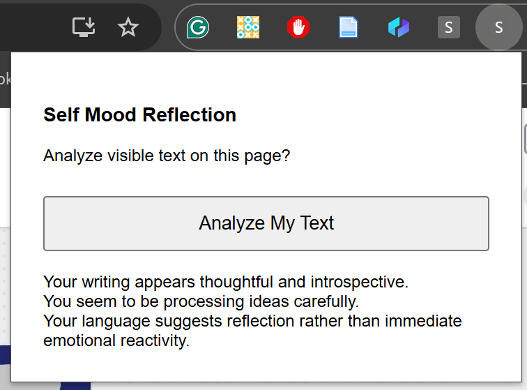
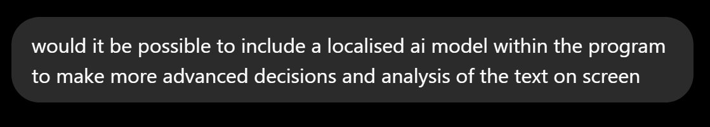
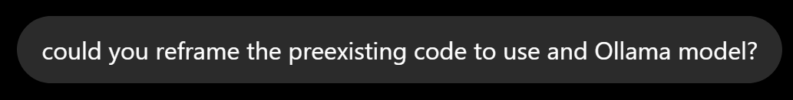

# Week 07

[← Back to Home](../index.md)

## Documentation 

### In Class Work

### Concept Sketch and response

For the in-class portion, I quickly made another iteration of the concept sketch, as well as the product that I had developed so far (chrome web extension).

The responses I received on the sticky notes from my classmates commented on the feasibility of executing the idea, saying that there is a lot of technical development to be made for this to be a working app. They also said that there are issues with the consideration for user safety, as the data could be misused for malicious purposes, and also doesn't properly address the issue of user and participant consent, as it is intended to run discreetly.

I think these are important concerns to address, as they reflect the feasbility and legality of my product. In response to this, I am reframing my project as one that exists within the context of the course, and will likely not be pursued afterwards. As such, I can acknowledge the issues within my project scope without having them directly affect the process or outcome of my project.

### Making Sprint

In this making sprint, I essentially just used ChatGPT to expand on the functions of the initial browser extension, wherein I would feed it prompts such as:

and

However, despite producing a result, the code wasn't able to function properly (for reasons I am unable to diagnose at my skill level), and subsequently was left with one working iteration, and two non working versions that were inherently more complex and difficult to run. ChatGPT responded to this by advising that chrome would likely be unable to properly execute the desired functionalities I had asked for due to the limitations of chrome's policies and physical abilities. As such, I decided it was time to start further developing the project as a separate app outside of chrome extensions.

### What If? Variations

In my friend group I asked for some advice on how I could further develop my concept into different potential directions. The idea that stuck out to me the most was to create a chat bot that would exist as part of the groupchat as visible to all users, therefore eliminating the need for written consent. This would also include the functionality of being able to hide the bot, and create constraints around which users' data it did and did not utilise. Visually, this would look pretty much exactly the same as the sketches I have made prreviously, except that all chat users would be able to see it. 

### Independant study

I created a slideshow for class that would display the project to my group. I also used DuoLingo as a primary visual reference in this, as I felt it communicated the ideas I had in my previous visual references with more condensed and direct usage of tools and interface.

*Include your documentation for the week. Devise your own structure of headings relevant to the required tasks and your process.*

## Images & Media

*Use the format below to embed images from your assets folder:*

``
`*Your caption here*`

*The text inside the square brackets is alt text (a description for accessibility), not a visible caption. To add a caption, place a line of italic text below the image.*

## AI Usage Statement

*Document any use of AI tools under an AI Usage Statement heading. Explain which tools you used and describe how you used them. Reference any AI-generated content (see [QuickCite](https://auckland.libguides.com/referencing-generative-ai-tools) for guidance).*
