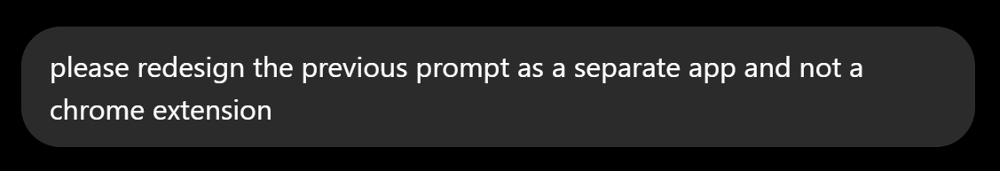
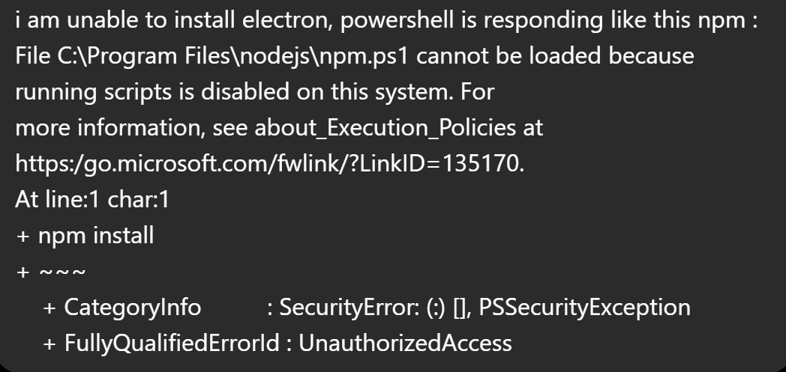
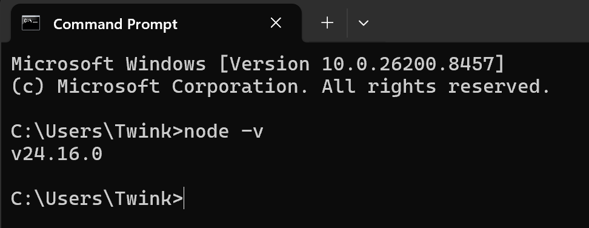
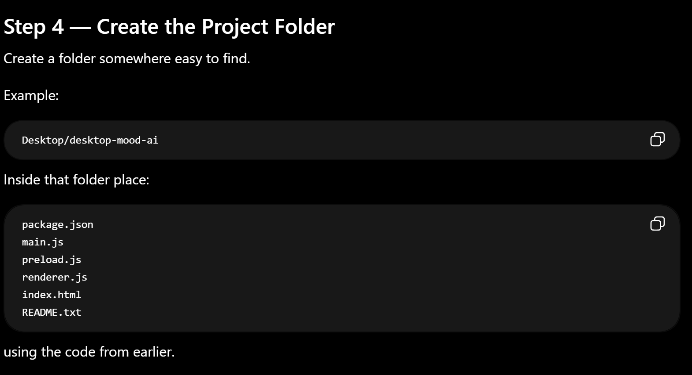
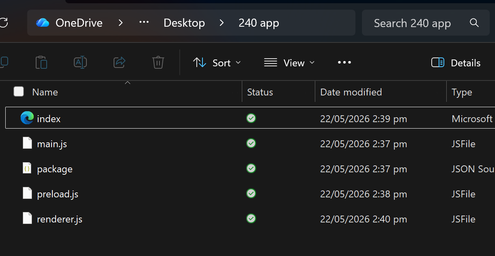
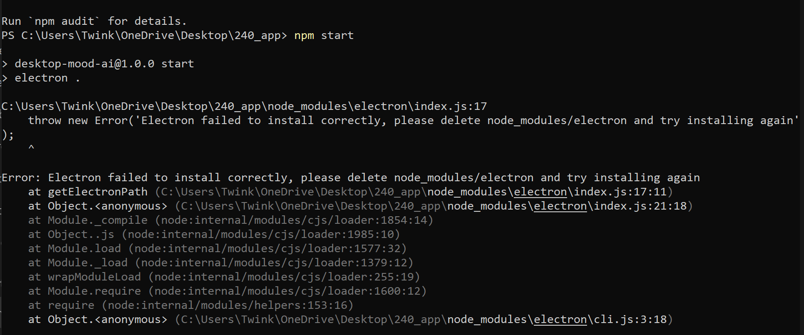

# Week 10

[← Back to Home](../index.md)

## Documentation 

As I was unable to make it to class this week due to being sick, I just focused on continuing my work on my project.

### Out of Class Work

As the image depicts, I asked ChatGPT to regenerate the code for a working app format. Once it had generated the code, I had to figure out how to run the app to check if it was working properly. 

Upon asking for more information, ChatGPT prompted me to install Node.js, which is a program that would be able to run my program, as I have no previous experience with app development.

I encountered more issues as this progressed, as Windows security prevented me from running the application due to a violation of the system functions.

After relaying this, ChatGPT presented me with a solution which would use the bypass function to override the statement presented by my computer preventing me from running the program. 

I verified the proper installation of Node.js per ChatGPT's instructions

(Fyi my computer username is Twinkletoes I have no idea why it's been shortened to Twink)

Per ChatGPT's instructions, I compiled the code into a folder.

I was running into issues after this relating to being able to run the npm install function

This was entirely my fault. I had forgotten to include Onedrive in the path, resulting in a series of errors. Once I had fixed it and continued following ChatGPT's instructions to run the app, this happened:

As per ChatGPT, this was the result of Onedrive not being able to support the application's running. As such, I decided to try again but from a copy of the file from my downloads folder.

After troubleshooting, the app opened, but required text input to be able to work properly. So this app now works relying on manual input rather than being automated data collection. I will develop this further next week.

## AI Usage Statement

I used ChatGPT to create the app, as well as troubleshoot any errors I encountered along the way.