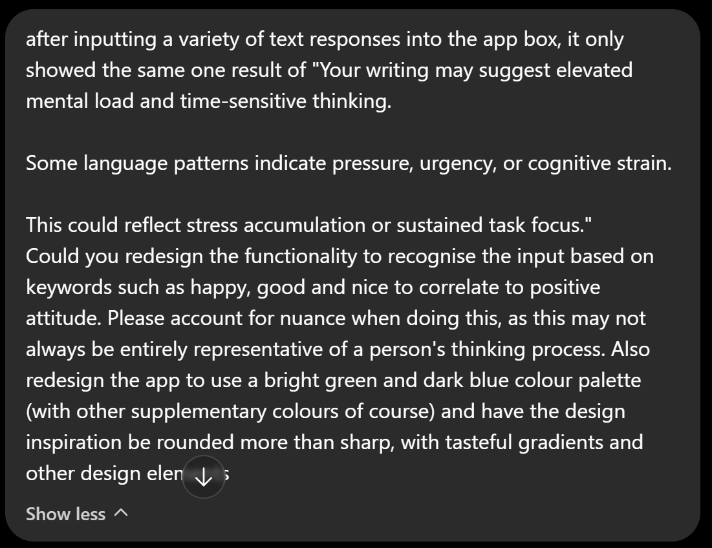
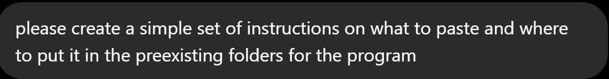
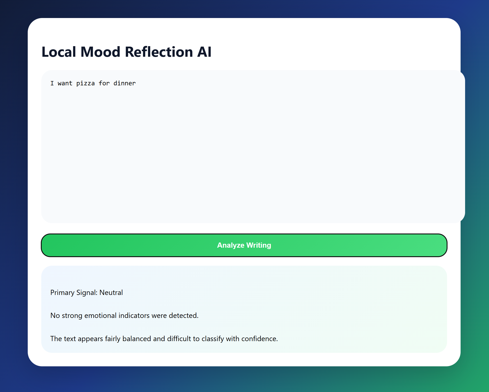
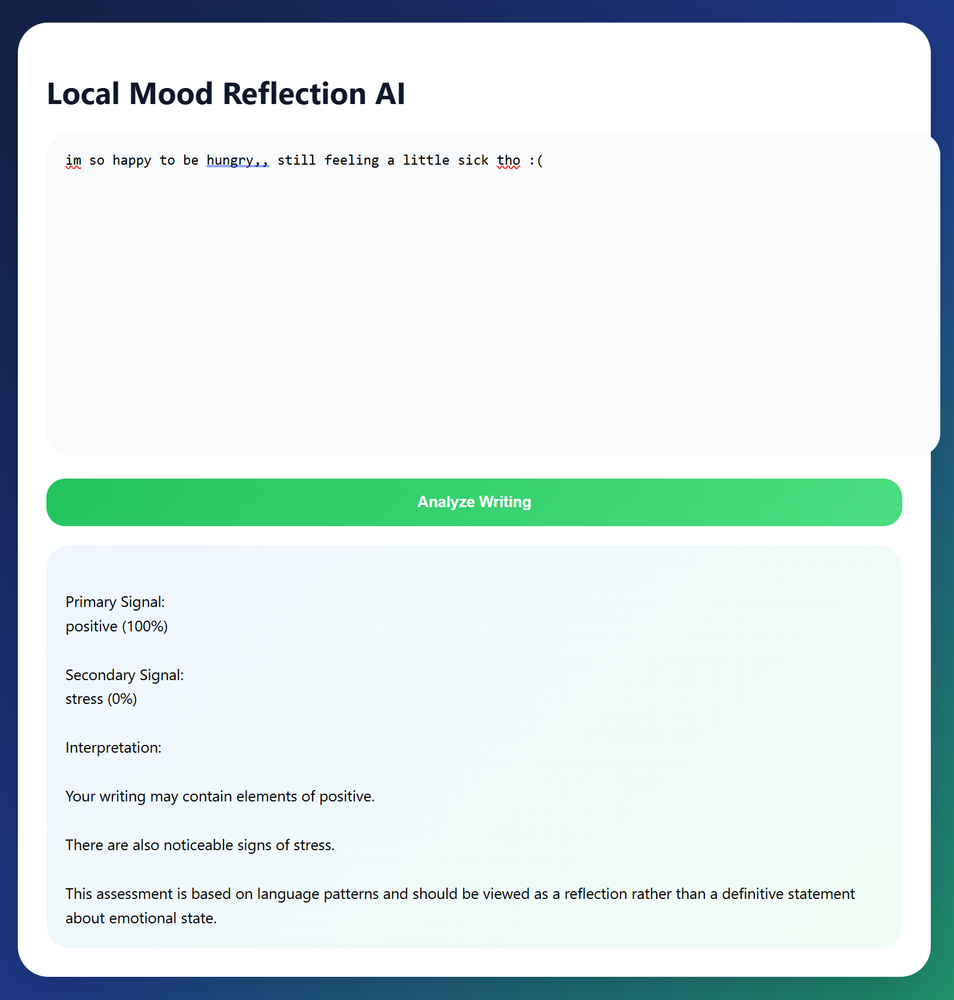

# Week 11

[← Back to Home](../index.md)

## Documentation 

I was sick again this week, and didn't make it to class for the in-class activities :(

### Out of Class work

This week, I continued the app development.

Summatively, last week I:

* Bugfixed the app to be functional
* Discovered that the app generated by ChatGPT would only be able to take manual text input from the user

This week, I hope to finish developing the app according to the increased functionality and specificity I had hoped for prior. 

I asked ChatGPT to generate a series of developments according to these prompts:

The result from these developments is as such:

There is a glaring error with the size of the text input box, so I will ask for this to be changed when I have more text credits from ChatGPT :'(. I will also be fixing the response to secondary signals provided by the text response, as the stress (0%) does not properly correlate to the response text provided by the program. 

I will also be subsequently further refining the app to be more aligned to the original intentions (i.e. treating the input as not from the app user but another person in the text conversation). This will involve also an option for the user to select from a positive, neutral or negative box so as to generate a related response to the text that the user can use to inform their response in the real time text conversation. 

**Note that I am still unable to use electron to run the app for SOME REASON and as such am currently running it from the browser.

After more battles, trying to get electron to properly install the path and other files that it was missing out for some reason, I got to the point of development where Ollama is situated within the code to be able to generate a response, but is struggling to connect to Ollama. I do not have any more ChatGPT credits, and therefore cannot ask for any more code refinements. I unfortunately as such will have to revert to a previous model which does not use Ollama for the response portion.

### Reflection for the week

I was not able to properly execute the app function as per my original intentions, but along the way found that maybe a less automated approach which relies on the manual and conscientious input from the user may lead to the user being less totally reliant on the app's function, and subsequently hopefully learning to predict conversational patterns. I think this is the preferred outcome as this will be more positively influential to the user in their online experience than having an app that could potentially reduce their critical thinking skills with overreliance. I do wish that I had more time to bugfix and integrate Ollama into my program in a way that works.

## AI Usage Statement

I used ChatGPT to create the app, as well as troubleshoot any errors I encountered along the way.
