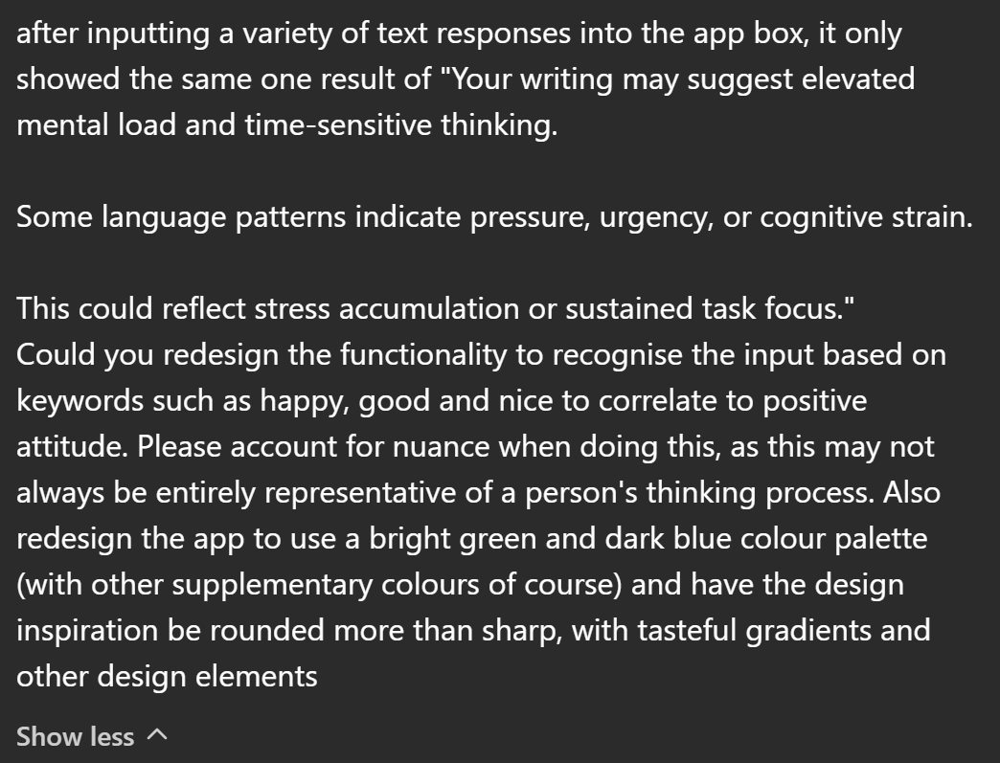

# Week 11

[← Back to Home](../index.md)

## Documentation 

I was sick again this week, and didn't make it to class for the in-class activities :(

### Out of Class work

This week, I continued the app development.

Summatively, last week I:

* Bugfixed the app to be functional
* Discovered that the app generated by ChatGPT would only be able to take manual text input from the user

This week, I hope to finish developing the app according to the increased functionality and specificity I had hoped for prior. 

I asked ChatGPT to generate a series of developments according to these prompts:

## Images & Media

*Use the format below to embed images from your assets folder:*

``
`*Your caption here*`

*The text inside the square brackets is alt text (a description for accessibility), not a visible caption. To add a caption, place a line of italic text below the image.*

## AI Usage Statement

*Document any use of AI tools under an AI Usage Statement heading. Explain which tools you used and describe how you used them. Reference any AI-generated content (see [QuickCite](https://auckland.libguides.com/referencing-generative-ai-tools) for guidance).*
